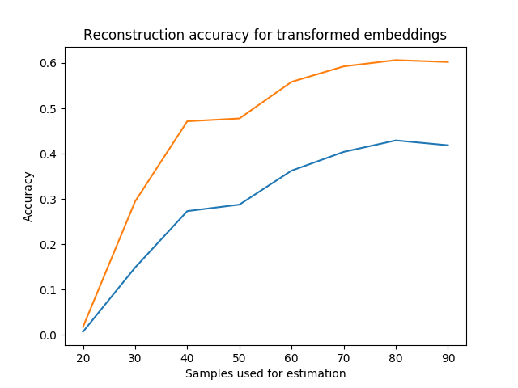

# Are word embeddings universal?

The latent variable space is normally non-identifiable up to an orthonormal transformation, so no. But, can we estimate that transformation given a small set of paired points?

Does it work for less explicitly paired data eg different language word embeddings? What about sentence embeddings?

Reconstruction accuracy for 20D embedding, $|V|=5000$

## ToDo

 - [ ] Use better corpus eg europarl
 - [ ] Enforce orthonormality
 - [ ] Transform between languages
